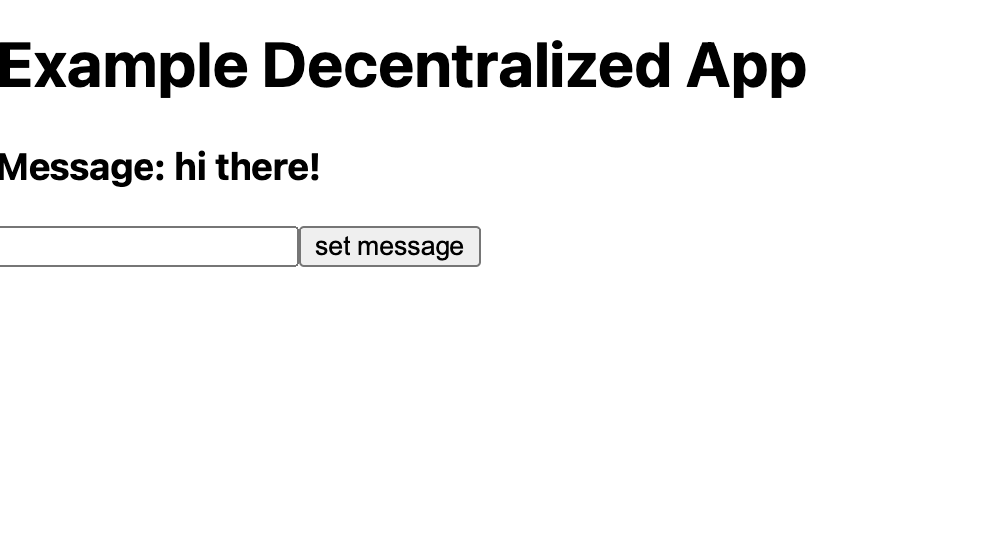
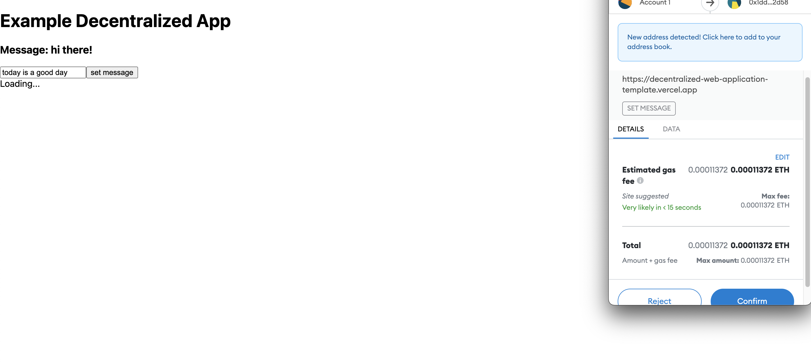
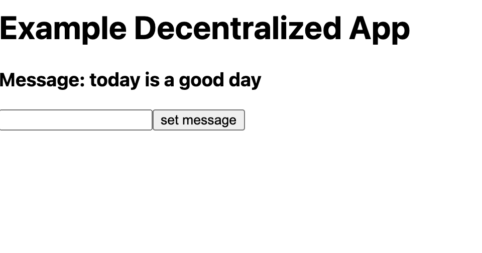
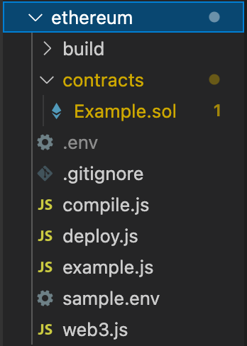
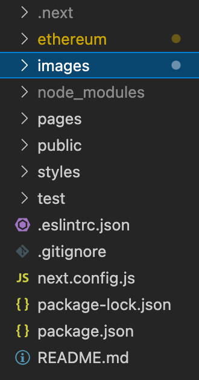

# Decentralized Web Application Template

# Instructions:
`npm i`
`npm run dev`
go to localhost:3000

# testing:
`npm run test`

# dependencies:
`npm i assert ganache-cli web3 fs-extra @truffle/hdwallet-provider mocha solc dotenv`

# deploy contract:
create .env file in ethereum directory
add env variables shown in sample.env file
`cd ethereum`
`node compile.js`
`node deploy.js`
in terminal you will see the address of the contract deployed on the network depending on the url used to deploy the contract

# notes:
- in deploy script, adjust gas based on contract usage
- example contract deployed on the rinkeby network
- contract address: 0x1ddcC5bC9ea017D692Eb3B9268D0c71318012d58

# Images:

# Further Questions:
create an issue with the tag help wanted and i'll get back to you
